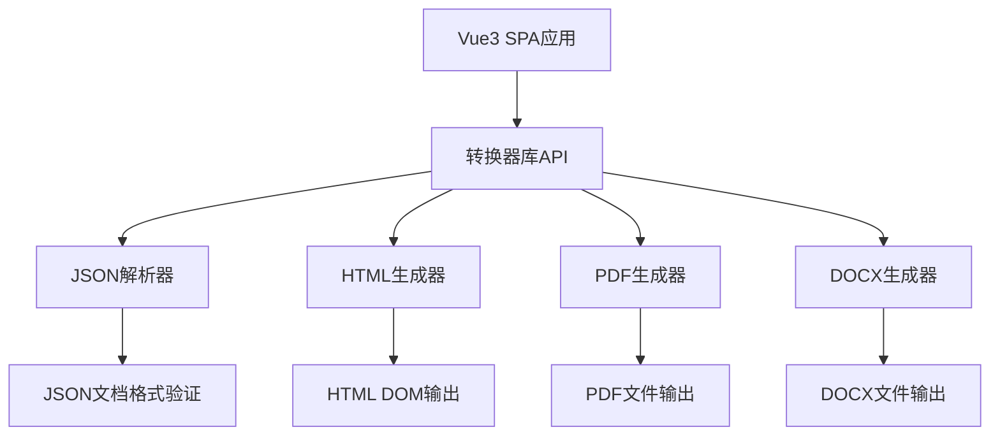

# Design Document

## Overview

本项目设计一个通用的JSON结构化文档转换器系统，采用monorepo架构，包含一个Vue3 SPA演示应用和一个独立的转换器库。系统能够将JSON格式的结构化文档数据转换为HTML、PDF和DOCX三种格式。

## Architecture

### 项目结构

```
json2docs/
├── packages/
│   └── converter/                 # 转换器库
│       ├── src/
│       │   ├── core/             # 核心转换逻辑
│       │   ├── parsers/          # JSON解析器
│       │   ├── generators/       # 格式生成器
│       │   └── index.js          # 主入口
│       ├── package.json
│       └── README.md
├── src/                          # Vue3 SPA应用
│   ├── components/               # Vue组件
│   ├── views/                    # 页面视图
│   ├── stores/                   # Pinia状态管理
│   ├── router/                   # Vue Router配置
│   └── main.js                   # 应用入口
├── public/                       # 静态资源
├── pnpm-workspace.yaml          # pnpm workspace配置
├── package.json                 # 根package.json
├── vite.config.js              # Vite配置
├── eslint.config.js            # ESLint配置
├── unocss.config.js            # UnoCSS配置
├── .gitignore
└── README.md
```

### 系统架构图



## Components and Interfaces

### 1. 转换器库核心组件

#### DocumentConverter类
```javascript
class DocumentConverter {
  constructor(options = {})

  // 主要转换方法
  convert(jsonData, outputFormat, options = {})

  // 格式验证
  validateJsonDocument(jsonData)

  // 支持的格式
  getSupportedFormats()
}
```

#### 格式生成器接口
```javascript
class BaseGenerator {
  constructor(options = {})

  // 抽象方法，子类必须实现
  generate(documentData, options = {})

  // 验证输入数据
  validateInput(documentData)
}
```

### 2. JSON文档格式规范

#### 基础文档结构
```javascript
{
  "version": "1.0",
  "metadata": {
    "title": "文档标题",
    "author": "作者",
    "created": "2025-01-24",
    "description": "文档描述"
  },
  "content": [
    // 文档内容块数组
  ],
  "styles": {
    // 样式定义
  }
}
```

#### 内容块类型
```javascript
// 标题块
{
  "type": "heading",
  "level": 1, // 1-6
  "text": "标题文本",
  "id": "heading-id"
}

// 段落块
{
  "type": "paragraph",
  "text": "段落文本",
  "alignment": "left" // left, center, right, justify
}

// 列表块
{
  "type": "list",
  "listType": "ordered", // ordered, unordered
  "items": [
    {
      "text": "列表项文本",
      "level": 0 // 嵌套层级
    }
  ]
}

// 表格块
{
  "type": "table",
  "headers": ["列1", "列2", "列3"],
  "rows": [
    ["数据1", "数据2", "数据3"]
  ]
}

// 图片块
{
  "type": "image",
  "src": "图片URL或base64",
  "alt": "替代文本",
  "width": 300,
  "height": 200
}
```

### 3. Vue3 SPA应用组件

#### 主要组件结构
```javascript
// DocumentEditor.vue - 文档编辑器
// FormatSelector.vue - 格式选择器
// PreviewPanel.vue - 预览面板
// DownloadButton.vue - 下载按钮
// JsonValidator.vue - JSON验证器
```

#### Pinia状态管理
```javascript
// stores/document.js
export const useDocumentStore = defineStore('document', {
  state: () => ({
    jsonDocument: null,
    selectedFormat: 'html',
    convertedResult: null,
    isConverting: false,
    errors: []
  }),

  actions: {
    setJsonDocument(data),
    convertDocument(),
    downloadResult()
  }
})
```

## Data Models

### 1. 文档数据模型

#### DocumentModel
```javascript
class DocumentModel {
  constructor(data) {
    this.version = data.version || '1.0'
    this.metadata = new MetadataModel(data.metadata)
    this.content = data.content.map(block => new ContentBlock(block))
    this.styles = new StylesModel(data.styles)
  }

  validate() {
    // 验证文档结构
  }
}
```

#### ContentBlock
```javascript
class ContentBlock {
  constructor(data) {
    this.type = data.type
    this.validateType()
    // 根据类型初始化特定属性
  }

  validateType() {
    const validTypes = ['heading', 'paragraph', 'list', 'table', 'image']
    if (!validTypes.includes(this.type)) {
      throw new Error(`Invalid block type: ${this.type}`)
    }
  }
}
```

### 2. 转换结果模型

#### ConversionResult
```javascript
class ConversionResult {
  constructor(format, data, metadata = {}) {
    this.format = format
    this.data = data
    this.metadata = metadata
    this.timestamp = new Date().toISOString()
  }

  toBlob() {
    // 转换为Blob对象用于下载
  }
}
```

## Error Handling

### 1. 错误类型定义

```javascript
// 自定义错误类
class DocumentConverterError extends Error {
  constructor(message, code, details = {}) {
    super(message)
    this.name = 'DocumentConverterError'
    this.code = code
    this.details = details
  }
}

// 错误代码常量
const ERROR_CODES = {
  INVALID_JSON: 'INVALID_JSON',
  UNSUPPORTED_FORMAT: 'UNSUPPORTED_FORMAT',
  CONVERSION_FAILED: 'CONVERSION_FAILED',
  VALIDATION_ERROR: 'VALIDATION_ERROR'
}
```

### 2. 错误处理策略

- **输入验证错误**: 提供详细的验证失败信息，指出具体的错误位置
- **转换错误**: 记录错误日志，提供用户友好的错误消息
- **格式不支持错误**: 明确指出支持的格式列表
- **网络错误**: 在SPA应用中提供重试机制

### 3. Vue应用错误处理

```javascript
// 全局错误处理
app.config.errorHandler = (err, vm, info) => {
  console.error('Vue Error:', err, info)
  // 发送错误报告或显示用户友好的错误消息
}

// 异步错误处理
async function handleAsyncError(asyncFn) {
  try {
    return await asyncFn()
  }
  catch (error) {
    // 统一的错误处理逻辑
    throw new DocumentConverterError(
      error.message,
      ERROR_CODES.CONVERSION_FAILED,
      { originalError: error }
    )
  }
}
```

## Testing Strategy

### 1. 单元测试

#### 转换器库测试
- **JSON解析器测试**: 验证各种JSON文档格式的解析正确性
- **格式生成器测试**: 测试HTML、PDF、DOCX生成器的输出质量
- **错误处理测试**: 验证各种错误情况的处理逻辑
- **API接口测试**: 测试公共API的功能和边界情况

#### Vue应用测试
- **组件单元测试**: 使用Vue Test Utils测试各个组件
- **状态管理测试**: 测试Pinia store的状态变更逻辑
- **路由测试**: 验证Vue Router的导航功能

### 2. 集成测试

- **端到端转换测试**: 从JSON输入到各种格式输出的完整流程测试
- **SPA与转换器库集成测试**: 验证前端应用与转换器库的交互
- **文件下载测试**: 测试生成文件的下载功能

### 3. 测试工具配置

```javascript
// vitest.config.js
export default {
  test: {
    environment: 'jsdom', // Vue组件测试需要DOM环境
    setupFiles: ['./test/setup.js'],
    coverage: {
      reporter: ['text', 'html'],
      threshold: {
        global: {
          branches: 80,
          functions: 80,
          lines: 80,
          statements: 80
        }
      }
    }
  }
}
```

### 4. 测试数据

创建标准的测试JSON文档，包含：
- 基础文档结构测试数据
- 复杂嵌套结构测试数据
- 边界情况测试数据
- 错误格式测试数据

## 技术选型说明

### 1. 前端技术栈
- **Vue3**: 使用Composition API，提供更好的TypeScript支持和逻辑复用
- **Vite**: 快速的构建工具，支持热更新和优化的生产构建
- **Vue Router**: 官方路由解决方案
- **Pinia**: Vue3推荐的状态管理库
- **UnoCSS**: 原子化CSS框架，提供高性能的样式解决方案

### 2. 转换器库技术栈
- **pdf-lib**: 纯JavaScript PDF生成库，无需服务器端支持
- **docx**: 用于生成Microsoft Word文档的JavaScript库
- **原生DOM API**: 用于HTML生成，确保输出的准确性

### 3. 开发工具
- **@antfu/eslint-config**: 统一的代码风格配置
- **lint-staged + simple-git-hooks**: 提交前代码检查
- **pnpm**: 高效的包管理器，支持workspace

## 性能考虑

### 1. 转换性能优化
- **流式处理**: 对于大型文档，采用流式处理避免内存溢出
- **缓存机制**: 缓存解析结果，避免重复计算
- **异步处理**: 转换操作使用Web Workers避免阻塞主线程

### 2. 前端性能优化
- **代码分割**: 按需加载转换器库
- **虚拟滚动**: 处理大型文档预览时的性能问题
- **防抖处理**: 用户输入时的实时验证使用防抖机制
